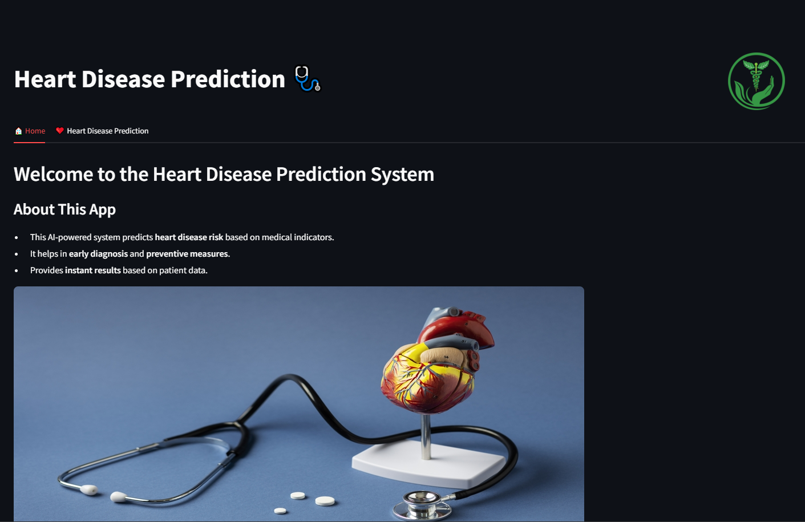
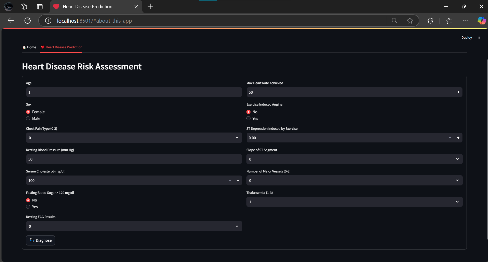

# 🏥 Disease Outbreak Prediction - Heart Disease Prediction

## 📌 Overview
The **Disease Outbreak Prediction** project is used to predict **heart disease** risk based on patient data. It uses **machine learning models** to analyze health indicators and provide risk assessments. The application helps users monitor their heart health and take preventive measures early.

## 📋 Features
- 🏠 **Home Page:** A user-friendly interface for easy navigation.
- 🔍 **Heart Disease Prediction:** Predicts heart disease risk using patient data.
- 📊 **Machine Learning Model:** Uses AI to analyze key health indicators.
- 🏥 **Health Insights:** Provides recommendations based on predictions.

## 🏥 How It Works
1. **User inputs health metrics** (Age, Blood Pressure, Cholesterol, etc.)
2. **ML Model processes the input** and predicts heart disease risk.
3. **Results are displayed with insights and recommendations.**

## 📸 Screenshots
- **Home Page:** `images/home.png`
- **Prediction Page:** `images/heart.png`

## 🤝 Contributing
Feel free to **fork** the repository and submit **pull requests**. Contributions are welcome!

## 📄 License
This project is **MIT Licensed**. See `LICENSE` for details.

## 📩 Contact
For any queries, reach out to: https://satish-tec.github.io/
